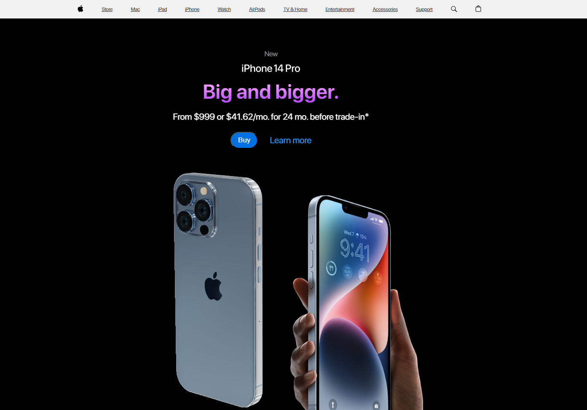

### iPhone Web Application

This is a web application project that simulates an iPhone interface. It provides a user interface resembling the iPhone's home screen, allowing users to interact with various applications and features.

Live Demo
A live demo of the web application can be accessed  <a href="https://volodymyrkolisnichenko.github.io/iphone" target="iphoneLink"> here. 

Features
Home screen with app icons mimicking the iPhone interface.
Applications for various tasks and functions, such as messaging, weather, calendar, calculator, and more.
Interactive elements and animations for a smooth user experience.
Responsive design to ensure compatibility with different screen sizes.
Technologies Used
HTML: Markup language for creating the structure and content of the web application.
CSS: Stylesheets for defining the visual appearance and layout of the application.
JavaScript: Programming language used for adding interactivity and dynamic features.
React: JavaScript library for building user interfaces, used to create and manage components.
WebGI: WebGI is a library for working with 3D graphics in web applications. It provides powerful tools and features for creating and manipulating 3D graphics. The project utilizes the WebGI library for certain components or visual effects.
Other dependencies and packages: The project utilizes various libraries and dependencies to enhance functionality and provide additional features. Refer to the project's package.json file for a complete list.

Usage
To run the web application locally, follow these steps:

Clone the repository:
git clone https://github.com/volodymyrkolisnichenko/iphone.git

Navigate to the project directory:
cd iphone

Install the dependencies:
npm install

Start the development server:
npm run dev

Open your web browser and visit http://localhost:3000 to view the application.

Contributing
Contributions are welcome! If you would like to contribute to the project, please follow these steps:

Fork the repository.
Create a new branch for your feature or bug fix.
Make your modifications.
Commit and push your changes.
Submit a pull request explaining the changes you made.
License
This project is licensed under the MIT License.

Acknowledgments
This project was inspired by the design and functionality of the iPhone interface. Thank you to all the open-source contributors whose libraries and tools were used in this project.

Contact
For any questions, feedback, or inquiries, please contact  <a href="https://volodymyrkolisnichenko.github.io" target="_blank"> Volodymyr Kolisnichenko. 
